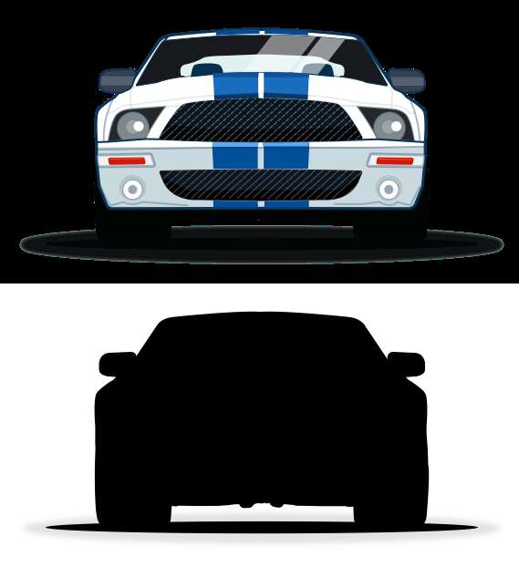

# AJPEG
This library provides transparency support to JPEG images.

Use the encoder in GULP to convert a PNG file with transparency into 2 files : a JPG file (without alpha) & a PNG containing the alpha channel only.

Use the decoder in your web app for image loading display purpose.

<table>
<tr>
<td>
Original 88ko
</td>
<td>
Compressed 19ko
</td>
<td>
Alpha 9ko
</td>
</tr>
<tr>
<td>

</td>
<td>

</td>
<td>

</td>
</tr>
</table>

## Install
```
$ npm install --save-dev ajpeg
```

##### Graphics Magick
Make sure GraphicsMagick is installed on your system and properly set up in your `PATH`.

- Mac OS X (using [Homebrew](http://brew.sh/)):

```shell
brew install graphicsmagick
```
- Ubuntu:

```shell
apt-get install graphicsmagick
```


## Encoding

```js
const gulp = require('gulp'),
    ajpeg = require('ajpeg');

gulp.task('default', function () {
    return gulp.src("src/*.png")
        .pipe(ajpeg(60))
        .pipe(gulp.dest('dist/'));
});
```


### API

#### ajpeg([quality])
Type: `number`
Default: `60`

JPEG compression from 1 to 100

## Decoding

### Setup
Include the library
```html
<script src="decoder/dist/ajpeg.min.js" type="application/javascript"></script>
```
OR
```js
const AJPEG = require('decoder/dist/ajpeg.min');
```

### Usage
Load into a Canvas
```js
new AJPEG().load("assets/rp1_00000.jpg", function () {
    document.body.appendChild(this.toCanvas());
});
```
Load into an Image
```js
new AJPEG().load("assets/rp1_00000.jpg", function () {
    var newImg = document.createElement('img');
    newImg.src = this.toDataURL();
    document.body.appendChild(newImg);
});
```
Autoload via html attribute parsing
```html

<script>
AJPEG.parse();
</script>
```

## License

MIT ©
